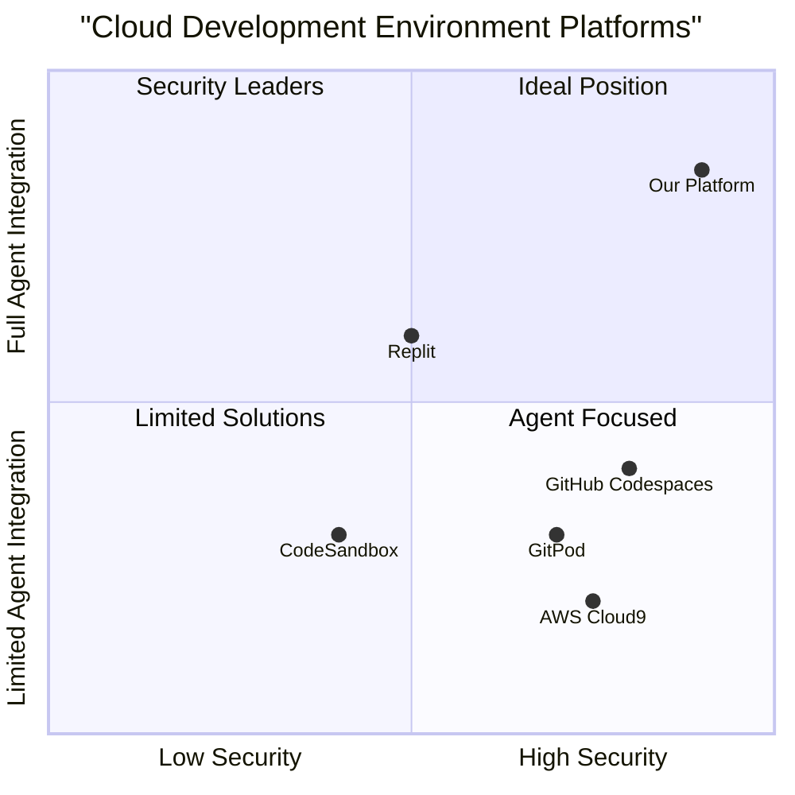

# AI Agent Cloud Workspace Platform PRD

## 1. Product Overview

### 1.1 Product Vision
AI Agent Cloud Workspace (AACW) is a secure, containerized cloud development environment that enables autonomous AI agents to operate with full system control while maintaining security and isolation. The platform provides a web-based IDE interface with integrated agent capabilities, allowing users to simply communicate goals and let agents handle the technical implementation.

### 1.2 Original Requirements
- Create a cloud workspace for AI agents with full control capabilities
- Enable secure and isolated operation environment
- Provide web-based IDE interface
- Include credential management and GitHub integration
- Support web browsing capabilities
- Allow continuous system evolution through agent actions

### 1.3 Product Goals
1. Create a self-evolving development environment where AI agents can autonomously operate and improve
2. Enable natural language-based interaction for system control and goal setting
3. Maintain secure and persistent agent context across development sessions

## 2. User Stories

### 2.1 Core User Stories
1. As a developer, I want to delegate development tasks to AI agents in a secure environment so that they can autonomously implement solutions
2. As a product owner, I want to communicate high-level goals to the system so that agents can continuously improve and shape the platform
3. As a security engineer, I want to ensure all agent actions are contained and monitored so that the system remains secure and stable
4. As a user, I want to manage multiple agent workspaces with different access levels and configurations so that I can maintain separation of concerns

## 3. Market Analysis

### 3.1 Competitive Analysis



### 3.2 Competitor Analysis

1. GitHub Codespaces
- Pros:
  * Strong GitHub integration
  * Robust security features
  * VS Code compatibility
- Cons:
  * Limited AI agent capabilities
  * No autonomous system evolution
  * Higher cost for continuous operation

2. GitPod
- Pros:
  * Open-source foundation
  * Good workspace isolation
  * Multiple IDE support
- Cons:
  * Basic AI integration
  * Limited automation capabilities
  * Manual configuration required

3. AWS Cloud9
- Pros:
  * Deep AWS integration
  * Strong security controls
  * Collaborative features
- Cons:
  * Complex setup
  * No native AI agent support
  * AWS-centric approach

4. Replit
- Pros:
  * Simple user interface
  * Built-in AI features
  * Quick setup
- Cons:
  * Limited enterprise features
  * Basic security controls
  * Restricted environment

5. CodeSandbox
- Pros:
  * Easy to use
  * Good collaboration features
  * Quick prototyping
- Cons:
  * Limited production capabilities
  * Basic security features
  * No AI agent integration

## 4. Technical Requirements

### 4.1 Core System Components

#### 4.1.1 Containerization Layer
- Container orchestration using Kubernetes
- Isolated workspace per user/project
- Resource management and scaling
- Security policy enforcement

#### 4.1.2 IDE Interface
- Web-based IDE with VS Code compatibility
- Real-time file synchronization
- Integrated terminal access
- Multi-window support

#### 4.1.3 Agent System
- Secure agent runtime environment
- Agent state management
- Communication protocols
- Action monitoring and logging

#### 4.1.4 Security Layer
- Credential management system
- SSH key handling
- Secret storage
- Access control policies

### 4.2 Requirements Pool

#### P0 (Must Have)
1. Secure container isolation for each workspace
2. SSH and Git credential management
3. Web-based IDE interface
4. Agent execution environment
5. Real-time file synchronization
6. Access control and authentication
7. Secure storage for credentials
8. Activity monitoring and logging

#### P1 (Should Have)
1. Multiple agent support per workspace
2. Automated workspace provisioning
3. Resource usage analytics
4. Custom agent configuration
5. Backup and restore capabilities
6. Integration with popular services
7. Collaborative features

#### P2 (Nice to Have)
1. AI agent marketplace
2. Custom plugin support
3. Advanced analytics dashboard
4. Multi-cloud deployment
5. Custom security policies

## 5. UI Design Draft

### 5.1 IDE-Style Interface Layout

```
+----------------+-------------------------------------------+
|               |  Tab1*    Tab2     Tab3                  |
| File Explorer |  +----------------------------------+    |
| - Workspace   |  |                                  |    |
| - Agents      |  |  Agent Chat Interface             |    |
| - Config      |  |  [Dark theme, IDE-style]          |    |
| - Tasks       |  |                                  |    |
|               |  |  User: Setup new React project    |    |
|               |  |  Agent: I'll help you with that...| <--|
|               |  |                                  |    |
|               |  |  [Code blocks with syntax         |    |
|               |  |   highlighting]                   |    |
+---------------+  |                                  |    |
|               |  +----------------------------------+    |
| Active Agents |                                          |
| - Agent 1*    |  +----------------------------------+    |
| - Agent 2     |  |                                  |    |
| - Agent 3     |  |  Terminal / Command Palette      |    |
|               |  |  >_                              |    |
+---------------+  +----------------------------------+    |
|               |                                          |
| System Status |  +----------------------------------+    |
| - CPU: 45%    |  |  Real-time Agent Activities      |    |
| - Mem: 2.1GB  |  |  [Status and progress updates]   |    |
+----------------+------------------------------------------+
```

### 5.2 Interface Components

#### 5.2.1 Core UI Elements
1. File Explorer Panel
   - Workspace files and folders
   - Agent configuration files
   - Task history and logs
   - Git integration status

2. Agent Chat Interface
   - IDE-style dark theme
   - Syntax highlighted code blocks
   - Markdown support
   - Real-time typing indicators
   - Message threading

3. Command Palette (Ctrl/Cmd + P)
   - Quick command access
   - Agent task shortcuts
   - Context switching
   - File navigation

4. Multi-tab System
   - Different conversation contexts
   - Agent workspace views
   - Task-specific environments
   - Split view support

#### 5.2.2 Interactive Features
1. Real-time Updates
   - Live agent activity feed
   - Task progress indicators
   - System resource monitoring
   - Git status updates

2. Context Management
   - Session persistence
   - Conversation history
   - Environment state tracking
   - Quick context switching

3. Terminal Integration
   - Full terminal emulation
   - Command history
   - Output streaming
   - Multi-terminal support

### 5.3 Interaction Patterns

#### 5.3.1 Chat-Based Interaction
- Natural language input
- Code snippet support
- File drag-and-drop
- Inline file previews
- Smart completions

#### 5.3.2 Development Features
- Integrated git controls
- File system operations
- Environment management
- Package handling
- Debug console

#### 5.3.3 Agent Collaboration
- Multi-agent conversations
- Task delegation
- Progress tracking
- Resource sharing
- Context awareness

### 5.4 Theme and Styling

#### 5.4.1 Visual Design
- Dark theme by default
- Professional IDE aesthetics
- Consistent typography
- Clear visual hierarchy
- Minimal animations

#### 5.4.2 Color Palette
- Background: #1E1E1E
- Text: #D4D4D4
- Accent: #007ACC
- Success: #6A9955
- Error: #F14C4C
- Warning: #CCA700

### 5.2 Key Interface Components
1. Workspace Navigator
   - Project structure
   - Active agents list
   - Resource monitors

2. Code Editor
   - Multi-file editing
   - Syntax highlighting
   - Intelligent code completion

3. Agent Communication Console
   - Natural language input
   - Agent status display
   - Task progress tracking

4. Terminal/Output Area
   - Command execution
   - Build output
   - Log viewing

## 6. Security Considerations

### 6.1 Workspace Security
- Isolated container environments
- Resource usage limits
- Network policy enforcement
- File system isolation

### 6.2 Credential Management
- Encrypted credential storage
- Secure key management
- Token-based authentication
- Role-based access control

### 6.3 Agent Security
- Sandboxed execution
- Action validation
- Rate limiting
- Audit logging

## 7. Open Questions

1. Agent Limitations
   - What are the specific boundaries for agent actions?
   - How to handle conflicting agent operations?

2. Scaling Considerations
   - How to manage resource allocation for multiple active workspaces?
   - What are the limits for concurrent agent operations?

3. Security Validation
   - What security certifications should be pursued?
   - How to implement regular security audits?

4. Data Management
   - How to handle data persistence between sessions?
   - What backup strategies should be implemented?

5. Integration Capabilities
   - Which third-party services should be prioritized for integration?
   - How to manage API rate limits across services?


## 8. Autonomous Evolution System

### 8.1 Self-Improvement Architecture

#### 8.1.1 Agent Evolution Engine
- Self-modification capabilities
- Code review and validation system
- Performance metrics tracking
- Capability enhancement protocols

#### 8.1.2 Learning System
- Persistent memory storage
- Context maintenance across sessions
- Experience-based improvement
- Pattern recognition and adaptation

### 8.2 Natural Language Interaction

#### 8.2.1 Goal Processing System
- Natural language understanding
- Goal decomposition into tasks
- Priority management
- Success criteria definition

#### 8.2.2 Conversation Interface
- Context-aware responses
- Multi-turn dialogue management
- Intent recognition
- Clarification protocols

### 8.3 Autonomous Operation

#### 8.3.1 Continuous Integration/Deployment
- Self-managed CI/CD pipelines
- Automated testing
- Rollback capabilities
- Version control

#### 8.3.2 Event-Driven Architecture
- Real-time event processing
- Event sourcing
- Command pattern implementation
- State management

#### 8.3.3 Feedback Loop System
- Performance monitoring
- User interaction analysis
- Success rate tracking
- Adaptation mechanisms

### 8.4 System Evolution Framework

#### 8.4.1 Capability Management
- Dynamic capability loading
- Plugin architecture
- API versioning
- Dependency management

#### 8.4.2 Learning Pipeline
- Data collection
- Pattern analysis
- Model updates
- Knowledge integration

#### 8.4.3 Safety Mechanisms
- Evolution boundaries
- Safety checks
- Validation protocols
- Rollback triggers

### 8.5 Requirements for Autonomous Operation

#### P0 (Must Have)
1. Persistent memory system
2. Natural language goal processing
3. Self-improvement protocols
4. Event-driven architecture
5. Automated CI/CD pipeline
6. Safety validation system

#### P1 (Should Have)
1. Advanced context maintenance
2. Multi-agent coordination
3. Learning from user feedback
4. Automated capability updates
5. Performance optimization

#### P2 (Nice to Have)
1. Predictive adaptation
2. Cross-project learning
3. Automated resource scaling
4. Advanced pattern recognition

### 8.6 Evolution Metrics

#### 8.6.1 Performance Indicators
- Goal completion rate
- Response accuracy
- Processing time
- Resource efficiency
- User satisfaction

#### 8.6.2 Learning Metrics
- Knowledge acquisition rate
- Pattern recognition accuracy
- Adaptation speed
- Improvement trajectory

#### 8.6.3 Safety Metrics
- Error rate
- Recovery time
- Validation success rate
- Security compliance
